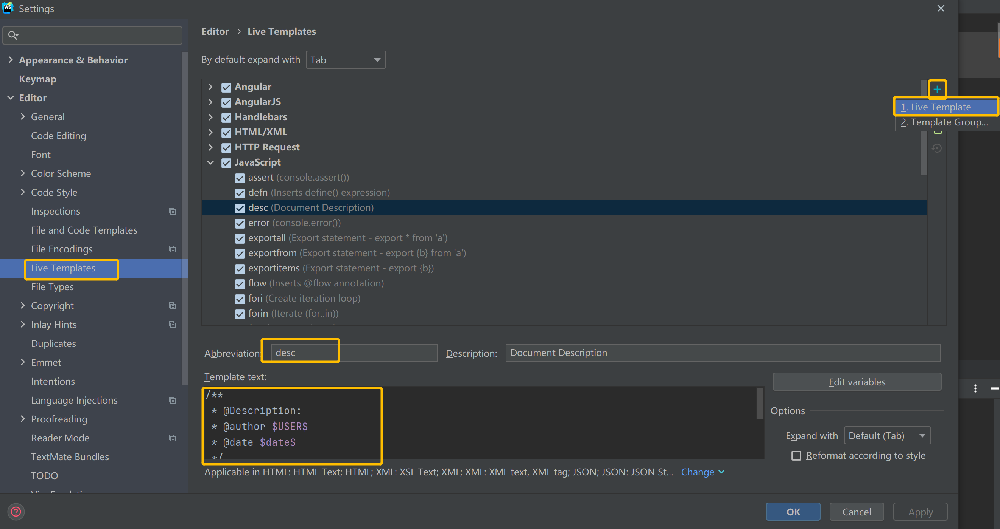
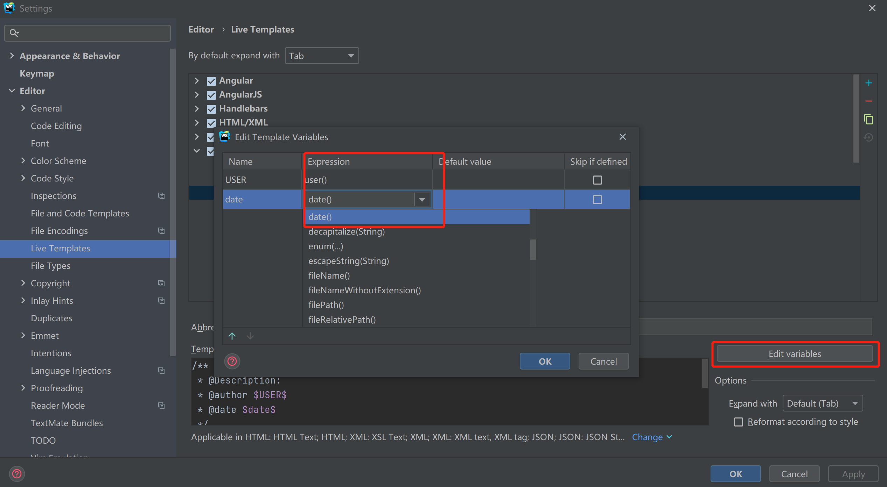
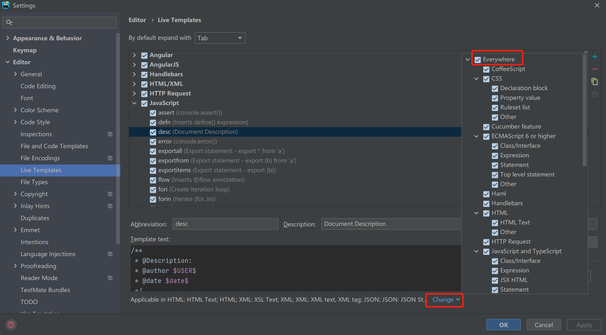

# 注释规范


> Comments begin with the characters `/*` and end with the characters `*/`. They may occur anywhere outside other tokens, and their contents have no influence on the rendering. Comments may not be nested.

- 注释以字符 `/*` 开始，以字符 `*/` 结束
- 注释不能嵌套

```
/*Comment Text*/
```

### 团队约定

#### 单行注释

注释内容第一个字符和最后一个字符都是一个空格字符，单独占一行，行与行之间相隔一行

*推荐：*

```css
/* Comment Text */
.jdc{}

/* Comment Text */
.jdc{}
```

*不推荐：*

```css
/*Comment Text*/
.jdc{
	display: block;
}
.jdc{
	display: block;/*Comment Text*/
}
```

#### 模块注释

注释内容第一个字符和最后一个字符都是一个空格字符，`/*` 与 模块信息描述占一行，多个横线分隔符`-`与`*/`占一行，行与行之间相隔两行

*推荐：*

```css
/* Module A
---------------------------------------------------------------- */
.mod_a {}


/* Module B
---------------------------------------------------------------- */
.mod_b {}
```

*不推荐：*

```css
/* Module A ---------------------------------------------------- */
.mod_a {}
/* Module B ---------------------------------------------------- */
.mod_b {}
```

#### 文件信息注释

在样式文件编码声明 `@charset` 语句下面注明页面名称、作者、创建日期等信息

```css
@charset "UTF-8";
/**
 * @desc File Info
 * @author Author Name
 * @date 2015-10-10
 */
```

注释可以创建模板，敲`desc`后敲tab自动补全：

~~~
/**
 * @Description:
 * @author $USER$
 * @date $date$
 */
~~~



设置用户名和日期变量：



设置绑定的文件类型，建议全选：



更多关于CSS注释：[#Comments](http://www.w3.org/TR/2011/REC-CSS2-20110607/syndata.html#comments)

