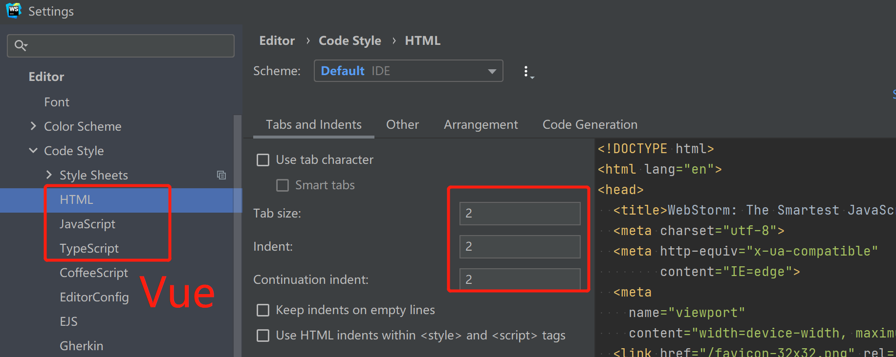

# 代码规范


## DOCTYPE 声明

### 团队约定

HTML文件必须加上 DOCTYPE 声明，并统一使用 HTML5 的文档声明：

```
<!DOCTYPE html>
```

## 页面语言LANG

Lang属性的取值应该遵循互联网工程任务组–IETF（The Internet Engineering Task Force）制定的关于语言标签的文档 [BCP 47 - Tags for Identifying Languages](http://tools.ietf.org/html/bcp47)

### 团队约定

推荐使用属性值 `cmn-Hans-CN`（简体, 中国大陆），但是考虑浏览器和操作系统的兼容性，目前仍然使用 `zh-CN` 属性值

```
<html lang="zh-CN">
```


更多地区语言参考：

```
zh-SG 中文 (简体, 新加坡)   对应 cmn-Hans-SG 普通话 (简体, 新加坡)
zh-HK 中文 (繁体, 香港)     对应 cmn-Hant-HK 普通话 (繁体, 香港)
zh-MO 中文 (繁体, 澳门)     对应 cmn-Hant-MO 普通话 (繁体, 澳门)
zh-TW 中文 (繁体, 台湾)     对应 cmn-Hant-TW 普通话 (繁体, 台湾)
```

#### 已废弃不推荐使用的 Languages Tags

以下写法已于 2009 年废弃，请勿使用（cmn、wuu、yue、gan 等已由 2005 年的 extlang 升级到 2009 年的 language）：

```
zh-cmn, zh-cmn-Hans, zh-cmn-Hant, zh-wuu, zh-yue, zh-gan
```

以下写法已于 2009 年废弃，不推荐使用：

```
zh-Hans, zh-Hans-CN, zh-Hans-SG, zh-Hans-HK, zh-Hans-MO, zh-Hans-TW, 
zh-Hant, zh-Hant-CN, zh-Hant-SG, zh-Hant-HK, zh-Hant-MO, zh-Hant-TW
```

更多已废弃 Languages Tags 参考 [IANA Language Subtag Registry](http://www.iana.org/assignments/language-subtag-registry/language-subtag-registry) 里面的 “Type: redundant“”


## CHARSET

因为 ISO-8859 中字符集大小是有限的，且在多语言环境中不兼容，所以 Unicode 联盟开发了 Unicode 标准。

Unicode 标准覆盖了（几乎）所有的字符、标点符号和符号。

Unicode 使文本的处理、存储和运输，独立于平台和语言。

HTML-5 中默认的字符编码是 UTF-8

参阅 [HTML Unicode (UTF-8) Reference](http://www.w3schools.com/charsets/ref_html_utf8.asp)

### 团队约定

一般情况下统一使用 “UTF-8” 编码

```
<meta charset="UTF-8">
```


请尽量统一写成标准的 “UTF-8”，不要写成 “utf-8” 或 “utf8” 或 “UTF8”。根据 [IETF对UTF-8的定义](http://www.ietf.org/rfc/rfc3629)，其编码标准的写法是 “UTF-8”；而 UTF8 或 utf8 的写法只是出现在某些编程系统中，如 .NET framework 的类 System.Text.Encoding 中的一个属性名就叫 UTF8。

#### 更多关于

UTF-8写法: [UTF8 or UTF-8?](http://stackoverflow.com/questions/809620/utf8-or-utf-8)

GBK：[Application of IANA Charset Registration for GBK](http://www.ietf.org/assignments/charset-reg/GBK)

Charset ：[character-encoding-declaration](http://www.w3.org/TR/html5/document-metadata.html#character-encoding-declaration)

## 元素及标签闭合

HTML元素共有以下5种：

- 空元素：area、base、br、col、command、embed、hr、img、input、keygen、link、meta、param、source、track、wbr
- 原始文本元素：script、style
- RCDATA元素：textarea、title
- 外来元素：来自MathML命名空间和SVG命名空间的元素。
- 常规元素：其他HTML允许的元素都称为常规元素。

元素标签的闭合应遵循以下原则：

> Tags are used to delimit the start and end of elements in the markup. Raw text, escapable raw text, and normal elements have a start tag to indicate where they begin, and an end tag to indicate where they end. The start and end tags of certain normal elements can be omitted, as described below in the section on optional tags. Those that cannot be omitted must not be omitted. Void elements only have a start tag; end tags must not be specified for void elements. Foreign elements must either have a start tag and an end tag, or a start tag that is marked as self-closing, in which case they must not have an end tag.

- 原始文本元素、RCDATA元素以及常规元素都有一个开始标签来表示开始，一个结束标签来表示结束。
- [某些元素的开始和结束标签是可以省略的](http://www.w3.org/TR/html5/syntax.html#optional-tags)，如果规定标签不能被省略，那么就绝对不能省略它。
- 空元素只有一个开始标签，且不能为空元素设置结束标签。
- 外来元素可以有一个开始标签和配对的结束标签，或者只有一个自闭合的开始标签，且后者情况下该元素不能有结束标签。

### 团队约定

为了能让浏览器更好的解析代码以及能让代码具有更好的可读性，有如下约定：

- 所有具有开始标签和结束标签的元素都要写上起止标签，某些允许省略开始标签或和束标签的元素亦都要写上。
- 空元素标签都不加 “/” 字符

*推荐：*

```
<div>
    <h1>我是h1标题</h1>
    <p>我是一段文字，我有始有终，浏览器能正确解析</p>
</div>
	
<br>
```

*不推荐：*

```
<div>
    <h1>我是h1标题</h1>
    <p>我是一段文字，我有始无终，浏览器亦能正确解析
</div>

<br/>
```

更多关于元素及标签关闭：[#Elements](http://www.w3.org/TR/html5/syntax.html#elements-0)

## 书写风格

### HTML代码大小写

HTML标签名、类名、标签属性和大部分属性值统一用小写

*推荐：*

```
<div class="demo"></div>
```

*不推荐：*

```
<div class="DEMO"></div>
	
<DIV CLASS="DEMO"></DIV>
```

HTML文本、CDATA、JavaScript、meta标签某些属性等内容可大小写混合

```
<!-- 优先使用 IE 最新版本和 Chrome Frame -->
<meta http-equiv="X-UA-Compatible" content="IE=edge,chrome=1"/>

<!-- HTML文本内容 -->
<h1>I AM WHAT I AM </h1>

<!-- JavaScript 内容 -->
<script type="text/javascript">
  var demoName = 'demoName';
  ...
</script>
	
<!-- CDATA 内容 -->
<script type="text/javascript"><![CDATA[
...
]]></script>
```

### 类型属性

不需要为 CSS、JS 指定类型属性，HTML5 中默认已包含

*推荐：*

```
<link rel="stylesheet" href="" >
<script src=""></script>
```

*不推荐：*

```
<link rel="stylesheet" type="text/css" href="" >
<script type="text/javascript" src="" ></script>
```

### 元素属性

- 元素属性值使用双引号语法
- 元素属性值可以写上的都写上

*推荐：*

```
<input type="text">
	
<input type="radio" name="name" checked="checked" >
```

*不推荐：*

```
<input type=text>	
<input type='text'>
	
<input type="radio" name="name" checked >
```

更多关于元素属性：[#Attributes](http://www.w3.org/TR/html5/syntax.html#attributes-0)

### 特殊字符引用

> In certain cases described in other sections, text may be mixed with character references. These can be used to escape characters that couldn’t otherwise legally be included in text.

文本可以和字符引用混合出现。这种方法可以用来转义在文本中不能合法出现的字符。

在 HTML 中不能使用小于号 “<” 和大于号 “>”特殊字符，浏览器会将它们作为标签解析，若要正确显示，在 HTML 源代码中使用字符实体

*推荐：*

```
<a href="#">more&gt;&gt;</a>
```

*不推荐：*

```
<a href="#">more>></a>
```

更多关于符号引用：[#Character references](http://www.w3.org/TR/html5/syntax.html#character-references)

### 代码缩进

统一使用两个空格进行代码缩进，使得各编辑器表现一致（各编辑器有相关配置）

```
<div class="jdc">
  <a href="#"></a>
</div>
```

>  Webstorme



###  纯数字输入框

使用 `type="tel"` 而不是 `type="number"`

```
<input type="tel">
```

### 代码嵌套

元素嵌套规范，每个块状元素独立一行，内联元素可选

*推荐：*

```html
<div>
  <h1></h1>
  <p></p>
</div>	
<p><span></span><span></span></p>
```

*不推荐：*

```html
<div>
  <h1></h1><p></p>
</div>	
<p> 
  <span></span>
  <span></span>
</p>
```

段落元素与标题元素只能嵌套内联元素

*推荐：*

```html
<h1><span></span></h1>
<p><span></span><span></span></p>
```

*不推荐：*

```html
<h1><div></div></h1>
<p><div></div><div></div></p>
```

