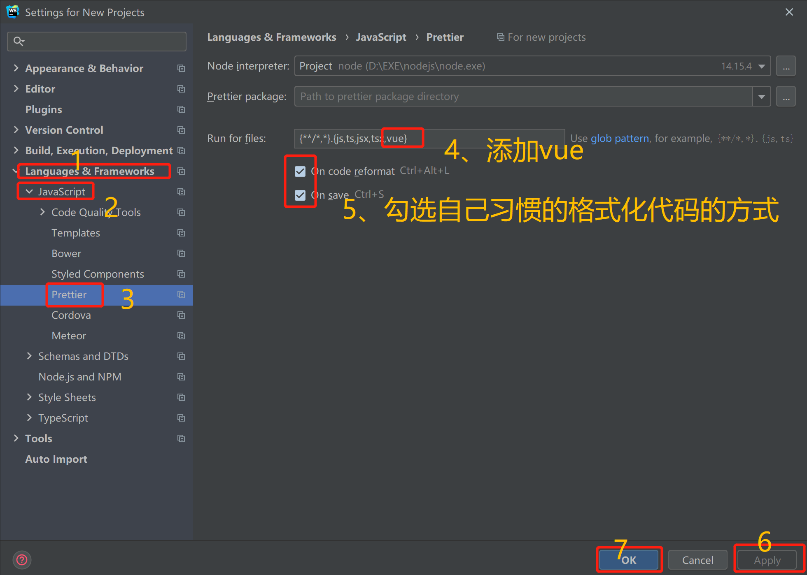

# 代码格式化

`统一使用eslint + prettier + editorconfig`
## 代码缩进

统一使用`两个空格`进行代码缩进，使得各编辑器表现一致，用`editorconfig`统一规范,见后续。

> 代码格式化统一使用`eslint `+ `prettier `+ `editorconfig`

## 行分隔符

统一使用`LF` Unix and MacOS(\n)

## ESlint

ESLint 是一个开源的 JavaScript 代码检查工具，由 Nicholas C. Zakas 于2013年6月创建。代码检查是一种静态的分析，常用于寻找有问题的模式或者代码，并且`不依赖于具体的编码风格`。对大多数编程语言来说都会有代码检查，一般来说编译程序会内置检查工具。

## Prettier

`VsCode和WebStorm都可以使用，不受编辑器的限制。`编码风格格式化工具。

### VsCode配置

1. 下载安装

2. 设置为默认格式化工具

### WebStorm配置

1. 下载安装

2. 配置

   (1). 当前项目配置

      

   (2). 新项目配置（全局）

      

3. 添加文件依赖

   

## 统一设置.editorconfig

​                                                                                                                                                                                                                                  

