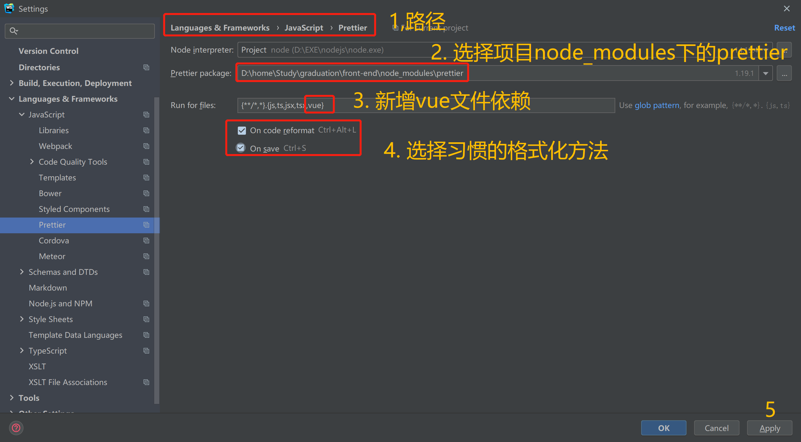

# 代码格式化


`统一使用eslint + prettier + editorconfig`


### 解决模式

代码格式化使用 **专事专办** 的方法。在这种情况下，ESLint 为代码质量检测器，Prettier 充当代码格式化工具，而 EditorConfig 将为每个人提供正确的编辑器配置。

- 与编辑器相关的所有配置（结尾行、缩进风格、缩进大小、行分隔符等等）,由 `EditorConfig `来处理。
- 和代码格式相关的一切事物应该由 `Prettier `处理。
- 剩下的（代码质量）由 `ESLint `负责。

## 安装配置(需要单独配置)

### 1. ESlint

ESLint 是一个开源的 JavaScript 代码检查工具，由 Nicholas C. Zakas 于2013年6月创建。代码检查是一种静态的分析，常用于寻找有问题的模式或者代码，并且`不依赖于具体的编码风格`。对大多数编程语言来说都会有代码检查，一般来说编译程序会内置检查工具。

。。。

> vscode需要安装插件


### 2. Prettier

`VsCode和WebStorm都可以使用，不受编辑器的限制。`编码风格格式化工具。

#### VsCode安装使用

1. 下载安装


2. 设置为默认格式化工具


#### WebStorm安装使用

1. 下载安装


2. 配置

   (1). 当前项目配置

      

   (2). 新项目配置（全局）

      

3. 添加文件依赖

   


### 3.EditorConfig

vscode需要安装插件，webstorm内置


## 统一配置


###  安装

先得安装`ESLint`和`Prettier`，还需要安装 `eslint-plugin-prettier`。

为了防止`Prettier`和`ESLint`格式化功能冲突，还需要安装 `eslint-config-prettier` 来关闭`ESLint`中的代码格式化功能

```text
npm install --save-dev eslint  //vue项目初始化一般会自动安装
npm install --save-dev --save-exact prettier


npm install --save-dev eslint-plugin-prettier
npm install --save-dev eslint-config-prettier
npm install --save-dev eslint-plugin-vue

```


### 代码缩进

统一使用`两个空格`进行代码缩进，使得各编辑器表现一致，用`editorconfig`统一规范，可以不用单独配置，见后续。


### 行分隔符

统一使用`LF` Unix and MacOS(\n)，用`editorconfig`统一规范，可以不用单独配置，见后续。


### editorconfig

统一设置.editorconfig  文件                                                                                                                                                                                

~~~
# 告诉EditorConfig插件，这是根文件，不用继续往上查找
root = true

# 匹配全部文件
[*]
charset = utf-8
# 结尾换行符，可选lf、cr、crlf
end_of_line = lf
# 缩进的空格数
indent_size = 2
# 缩进风格，可选space、tab
indent_style = space
# 在文件结尾插入新行
insert_final_newline = true
# 一行的最大宽度
max_line_length = 120
# tab的宽度
tab_width = 2


# 删除一行中的前后空格
trim_trailing_whitespace = true

# 匹配md结尾的文件
[*.md]
insert_final_newline = false
trim_trailing_whitespace = false

~~~


### .prettierrc文件配置

```json
{
  "semi": true,//
  "singleQuote": true,
  "bracketSpacing": true,
  "proseWrap": "always"
}
```

​                                                                                                                                                                         

可以配置的参数

~~~js
{
  printWidth: 80, //单行长度
  tabWidth: 2, //缩进长度
  useTabs: false, //使用空格代替tab缩进
  semi: true, //句末使用分号
  singleQuote: true, //使用单引号
  quoteProps: 'as-needed', //仅在必需时为对象的key添加引号
  jsxSingleQuote: true, // jsx中使用单引号
  trailingComma: 'all', //多行时尽可能打印尾随逗号
  bracketSpacing: true, //在对象前后添加空格-eg: { foo: bar }
  jsxBracketSameLine: true, //多属性html标签的‘>’折行放置
  arrowParens: 'always', //单参数箭头函数参数周围使用圆括号-eg: (x) => x
  requirePragma: false, //无需顶部注释即可格式化
  insertPragma: false, //在已被preitter格式化的文件顶部加上标注
  proseWrap: 'preserve', //不知道怎么翻译
  htmlWhitespaceSensitivity: 'ignore', //对HTML全局空白不敏感
  vueIndentScriptAndStyle: false, //不对vue中的script及style标签缩进
  endOfLine: 'lf', //结束行形式
  embeddedLanguageFormatting: 'auto', //对引用代码进行格式化
}  
~~~

